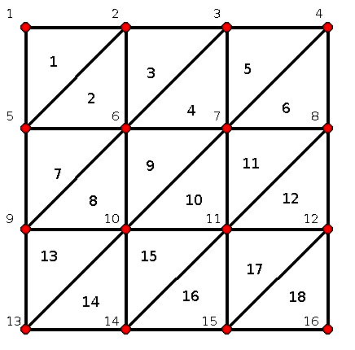

Adaptive mesh refinement for XY->Z problems
===========================================

Overview
--------

When performing numerical simulations one often deals with need to calculate certain
values for each point in the predefined grid on XY plane, which typically looks like 
this 
<br/><center></center><br/>
As a result of such
calculation a 2D surface is formed in the X-Y-Z space. For example, the X axis might
correspond to applied voltage and Y axis to temperature and calculated value might be
current. More often than not, such surface have large smooth regions and small regions
where it is bending precipitously ( has high curvature ). If a simple rectilinear
grid of X and Y parameters is used to drive calculations then to capture features of
regions with high curvature one has to use, often, very fine mesh. Here is an example of
calculating for the following function
```ruby
Math::cos(x**2+y**2)/(x**2+y**2+0.5)
```
For the simple rectangular mesh, for X and Y changing from -2 to 2 and 121 vertexes 
in total
<br/>
<center>

</center>
<br/>
That is very rough, however there are just a couple of regions where we need the fine 
mesh. Here is an example of how it looks with the fine mesh.
<br/><center></center><br/>
This however required 10,000 vertexes.
But what is really needed here is to tip-toe over regions that are strongly bending and 
make just a few computations in the smooth regions. Additionally we want such procedure 
to be fully automated. So that we can start with very rough grid and let separate program
add new points to the grid as necessary to make it as smooth as some predefined value.
And this is exactly what this ruby package does. Here is what it can archive starting 
from 10 by 10 grid.
<br/><center></center><br/>
This is pretty smooth. And here is the grid with vertexes.
<br/><center></center><br/>
You can see that vertexes cluster right they need to be to expose essential features 
of the surface and most importantly it required only 1481 vertexes. 

Here is an example of an actual simulation. 
<br/><center></center><br/>
Again, you can see here that vertexes cluster in the areas that contain essential 
features where curvature is the greatest. 
Following X-Y view show projections of generated grid and its zoom
<br/><center></center><br/>
<br/><center></center><br/>

Algorithm
---------

To accomplish goals described in the overview following algorithm has been devised.
First, rectangular grid of vertexes is created spanning from **Xmin** to **Xmax** 
and from **Ymin** to **Ymax** with steps **dx=(Xmax - Xmin)/Nx** 
and **dy=(Ymax - Ymin)/Ny**, where **Nx** and **Ny** are number of steps along 
each axis. Then a set of triangular tiles is created.
<br/><center></center><br/>
All of the vertexes are arranged into array **V** and tiles in the doubly linked 
list **T**. Note that both, tiles and vertexes are numbered from 1, not 0.
Each of the vertexes are considered to be uninitialized until Z value 
(elevation above X-Y plane) is computed. Once Z values are computed we can proceed to 
mesh refinement based on some measure of curvature. The measure of curvature that we 
are using here significantly differs from classical definition and so as not to confuse 
two we use term "**nvariance**" and it is defined as following. 
<br/><center></center><br/>
For each of the tiles
we compute normal vector (shown in blue in the picture above) and for each adjacent 
tile ( sharing common edge ) we take a cross product of their normal vectors, 
absolute value of which we call nvariance or **NV**.
Thus nvariance can be calculated for any two pairs of tiles **i** and **j**, i.e. 
**NV=f(i,j)**. For us only nvariance of adjacent tiles has meaning of rough 
approximation of curvature. Obviously normal vectors of being length 1, nvariance changes 
from 0, for tiles that lie in the same plane, to 1, for tiles that lie at the 90 degree 
angle. And since we assume simple mapping of points in X-Y plane to only one point along Z 
axes, we will not ever have two tiles at the angle greater than 90 degrees.
If the nvariance of two given tiles is greater then we split in two that tile which has 
largest perimeter. Which ever tile we decide to split, we do so by adding new vertex along 
the longest side of that tile. For example for the picture above we might have found that 
nvariance of tiles 2 and 3 is larger than out preset limit and since perimeter of tile 3 is 
greater that will be the tile to split, like so.
<br/><center></center><br/>
Note that tile 3 is split away from the tile 2, with which it has the highest nvariance.
Also, note that tile 4 also became split, which we have to do just to maintain surface 
triangulation. If on a next iteration it was found that tiles 2 and 3 are still at the 
higher nvariance than desired, then tile 2 will be split, since its the one among two that 
has greater perimeter. As the iterative process continues it is possible that two tiles 
will be split along the common edge of tiles 2 and 3. By always splitting to the longest 
edge of larger, by perimeter, of two tiles, we avoid pathological case when very thing, with 
small surface area and large perimeter, tiles are created. This process could continue 
indefinitely until no two adjustment tiles have nvariance greater than desired. However, 
if there is some noise in the Z value, for example due to numerical errors in simulation,
then once the tile size reaches size comparable with size of these noise ripples our 
recursive process may restart and continue indefinitely. We need to limit either number 
of vertexes or area of the tiles. In this algorithm we limit not the area of the tile, 
but the area of its projection to X-Y plane in percentage, from 0 to 1, of the area of 
the original unrefined tiles. This guaranties that this refinement process stops. In 
pseudo-code this process looks like this

    Vertexes,Tiles = initialize_mesh(Xmin,Xmax,Nx, Ymin,Ymax,Ny)
    
    foreach vertex in Vertexes
        vertex.z = compute(vertex.x, vertex.y)

    do 
        tiles_split = 0
        foreach tile in Tiles
            if largest_nvariance(tile) > max_nvariance
                nv_tile = tile_with_which_this_tile_tile_has_largest_nvariance(tile) 
                if perimeter_of(tile) > perimeter_of(nv_tile) 
                    mark_for_splitting(tile)
                else
                    mark_for_splitting(nv_tile)

        foreach tile in maked_for_splitting(Tiles)
            if area_in_XY_plane(tile) > min_tile_area
                split_and_compute_at_new_vertex(tile)
                tiles_split = tiles_split + 1
    while tiles_split > 0

Installation
------------

You can install this ruby package directly from git repository. Note, that you may need to 
install 'rubygems' package for the following procedure to succeed.

    $ wget https://github.com/priimak/xymesh/archive/0.1.0.tar.gz
    $ tar zxvf 0.1.0.tar.gz
    $ cd xymesh-0.1.0
    $ gem build xymesh.gemspec
    $ sudo gem install ./xymesh-0.1.0.gem

This will install code for version `0.1.0`. To see other (older) tags you can do

    $ git tag --list

Usage
-----

To use this package you most likely will need to write a ruby script. Here is a basic 
skeleton of what needs to be in the script.  First you need to link to 'xymesh' package 
like this 

    require 'xymesh'

Then you need to create Proc function, which will be used to compute Z values at 
given X and Y points ( vertexes ). For above mentioned example of sombrero looking 
function, it will look like this

    computer = Proc.new { |x,y| Math::cos(x**2+y**2)/(x**2+y**2+0.5)}

Create Grid2D object populated with coarse rectangular mesh of vertexes

    grd = XYMesh::Grid2D.new(-2,2,10, -2,2,10, computer)

along the X axis we have 11 points from -2 to 2 braking that interval into 10 parts, 
and similarly along the Y axis. Now set minimum tile size in X-Y projection

    grd.min_tile_projected_area = 0.01

which indicates that minimum tile size in X-Y projection will be **original_tile_area * 0.01**.
Now compute Z values at the vertexes

    grd.compute

Now that tile are fully defined (initialized) you want to find existing maximum value 
of nvariance among the all adjacent tile pairs. And set new nvariance limit to be fraction 
of that value. To archive same result as in the pictures above you can use 1/6 of max nvariance

    new_max_nvariance = grd.max_nvariance()/6.0

Now start recursive process of refinement 

    grd.refine_recursively(new_max_nvariance)

This method scans all the tiles from first to last and splits them if their nvariance is 
greater than `new_max_nvariance` and X-Y tile are is greater than `min_tile_projected_area`.
Once last tile is reached it starts scanning them again until no tiles are split. And now we save 
result using java3d obj file format

    grd.save_safe_to_java3d_obj_file("hat.obj")

This method is called **save_safe** because it first saves data to a tmp file **#{fileName}.tmp** 
and then moves it over to a **#{fileName}**.
You can then view this file using any viewer that supports java3d format. To generate pictures for 
this page I used [javaview](http://www.javaview.de/index.html)

Here is a complete script that you can use to cat and paste

    #!/usr/bin/env ruby
    
    require 'xymesh'
    
    computer = Proc.new { |x,y| Math::cos(x**2+y**2)/(x**2+y**2+0.5)}
    grd = XYMesh::Grid2D.new(-2,2,3, -2,2,3, computer)
    grd.min_tile_projected_area = 0.01
    grd.compute
    new_max_nvariance = grd.max_nvariance()/6.0
    grd.refine_recursively(new_max_nvariance)
    grd.save_safe_to_java3d_obj_file("hat.obj")

Now a more realistic example would be if your compute function is actually another program that 
upon execution appends data to some csv file, line by line for each invocation. Then we just need 
to change value of **computer** variable above. For example it could look like this 

    computer = Proc.new { |e,omega| 
      system("./boltzmann_solver --E=#{e} --omega=#{omega} -o=+boltzmann.data")
      IO::readlines("boltzmann.data")[-1].split()[5].to_f
    }

where boltzmann_solver is a C program that appends results to space separated file **boltzmann.data** 
line by line. Calling

    IO::readlines("boltzmann.data")[-1]

give us last line that file, which we split on spaces

    IO::readlines("boltzmann.data")[-1].split()

and in this example we take the 5th element (counted from 0), convert it to float are return it

    IO::readlines("boltzmann.data")[-1].split()[5].to_f

Note, that in Ruby we do not have use **return** statement here since the value of last 
evaluated statement is returned by default. Now you may want to perform refinement process 
interactively by slowly reducing value of `new_max_nvariance`, which means that after 
saving results into **.obj** file you may want to restart computation from that point. To
do that you can try loading **.obj** file right after creation of Grid2D object. Assuming 
that **.obj** file is **boltzmann.obj** it will look like this

    grd.load_from_java3d_obj_file("boltzmann.obj")

If the file **boltzmann.obj** does not exist or is not readable then it is a NOOP. If the 
obj file is successfully loaded then calling **grd.compute** is a NO-OP. Additionally, in
the obj file we store value of `max_nvariance` that was used when file was generated. 
You can access that value by calling **grd.nvariance_limit**, which you then can use to set 
`new_max_nvariance` to the same value as one used originally. You can do that like this

    new_max_nvariance = grd.nvariance_limit.nil?() ? (grd.max_nvariance()/6.0) : grd.nvariance_limit

Now you may also want to view result of each refinement iteration. You can do so by using callback 
Proc function to save intermediate results in the obj file. Do to that you set value of `grd.iter_callback`, 
which is then called at the end of **grd.compute** method and each, including the last one, 
iterative refinement stages. You can do this like this

    grd.iter_callback = Proc.new { |grd2d, refined|
      print "refined = #{refined}\n"
      grd2d.save_safe_to_java3d_obj_file("boltzmann.obj")
    }

where **grd2d** is the reference to the same object as one referred to by **grd** variable 
and variable **refined** refers to number of tiles that were split at this iteration. So, here 
is a complete example script that you can use as a skeleton for your particular case.

    #!/usr/bin/env ruby
    
    require 'xymesh'

    computer = Proc.new { |e,omega| 
      system("./boltzmann_solver --E=#{e} --omega=#{omega} -o=+boltzmann.data")
      IO::readlines("boltzmann.data")[-1].split()[5].to_f
    }

    grd = XYMesh::Grid2D.new(0,10,10, 0,8,10, computer)
    grd.min_tile_projected_area = 0.01
    grd.load_from_java3d_obj_file("boltzmann.obj")

    grd.iter_callback = Proc.new { |grd2d, refined|
      print "refined = #{refined}\n"
      grd2d.save_safe_to_java3d_obj_file("boltzmann.obj")
    }

    grd.compute
    new_max_nvariance = grd.nvariance_limit.nil?() ? (grd.max_nvariance()/6.0) : grd.nvariance_limit
    grd.refine_recursively(new_max_nvariance)

You, obviously, need to change call to **./boltzmann_solver** to whatever the program you are using, 
as well as definition of the grid and obj file name.
